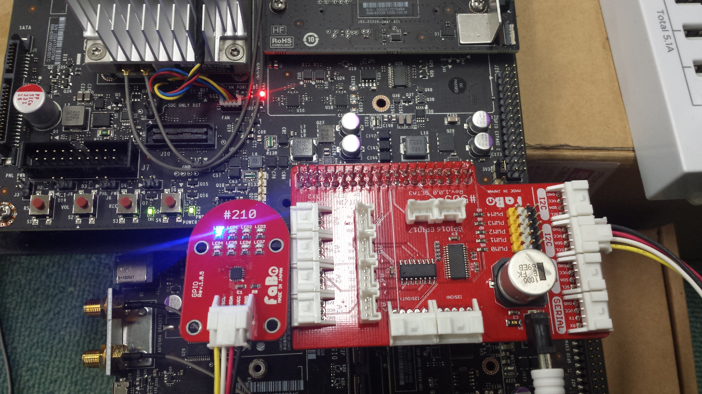

# I2C Fabo #210 LED
Jetson TX2 Docs>JetPack3.1>I2C Fabo #210 LED
<hr>

# Point
* rootユーザで実行する。

# 接続確認
Faboの#210 LEDで確認する。  


# I2Cアドレスを確認する
```
sudo i2cdetect -y -r 1
     0  1  2  3  4  5  6  7  8  9  a  b  c  d  e  f
00:          -- -- -- -- -- -- -- -- -- -- -- -- -- 
10: -- -- -- -- -- -- -- -- -- -- -- -- -- -- -- -- 
20: 20 -- -- -- -- -- -- -- -- -- -- -- -- -- -- -- 
30: -- -- -- -- -- -- -- -- -- -- -- -- -- -- -- -- 
40: 40 -- -- -- -- -- -- -- -- -- -- -- -- -- -- -- 
50: -- -- -- -- -- -- -- -- -- -- -- -- -- -- -- -- 
60: -- -- -- -- -- -- -- -- -- -- -- -- -- -- -- -- 
70: 70 -- -- -- -- -- -- --                         
```
Fabo #210 LEDにはLED電源を制御するためのチップとしてPCAL6408を搭載している。このチップのI2Cアドレスは0x20になる。<br>
アドレスが異なる場合はJetson TX2を一度シャットダウンしてJetson TX2とFaboシールドの電源ケーブルを抜く。<br>


# 実行
ソースコード：[sample_led.py](sample_led.py)
```
sudo python sample_led.py
```

# 結果
LEDが1秒間光る

Powered by [FaBo](http://www.fabo.io)