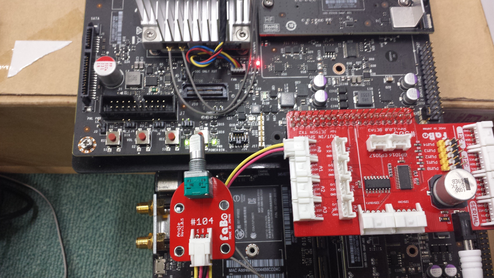

# SPI Fabo #104 回転センサー
Jetson TX2 Docs>JetPack3.1>SPI Fabo #104回転センサー
<hr>

# Point
* rootユーザで実行する

# 接続確認
Faboの#104 Angle Brickで確認する。  


# 実行
ソースコード：[sample_spi.py](sample_spi.py)
```
sudo python sample_spi.py
```

# 出力
回転センサーを回すと値が変化する。
```
adc :      839 
adc :      896 
adc :      921 
adc :      933 
adc :      931 
adc :      932 
adc :      933 
adc :     1018 
adc :     1023 
adc :     1022 
adc :     1023 
adc :     1023 
adc :     1022 
adc :     1023 
adc :      904 
adc :      594 
adc :      247 
adc :      190 
adc :      130 
adc :       89 
adc :       69 
adc :       53 
```

Powered by [FaBo](http://www.fabo.io)