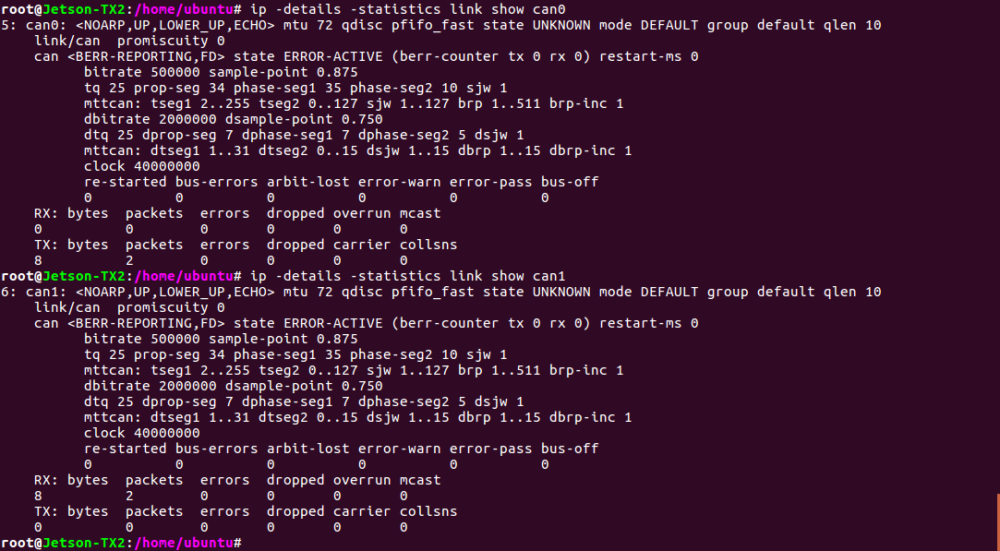
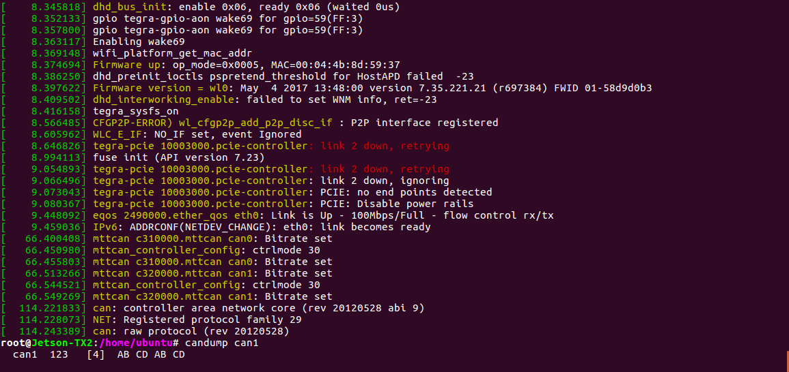

# CAN 有効化
Jetson TX2 Docs>JetPack3.1>CAN有効化
<hr>

## CANとは
BOSCHが開発したマルチマスターのメッセージブロードキャストシステム。1メガビット/秒(bps)の最大シグナリングレートを規定しています。<br>
USBやイーサネットなどの従来のネットワークとは異なり、CANは大きなブロックのデータを送りません。CANは中央バスマスタの監視下にあり、ノードAからノードBへのポイント to ポイント通信を行います。<br>
CANネットワークでは、温度やRPMなどの短いメッセージがネットワーク全体にブロードキャストされるため、システムのすべてのノードでデータの一貫性が確保されます。

参考：
* [Introduction to the Controller Area Network (CAN)](http://www.ti.com/lit/an/sloa101b/sloa101b.pdf)

###### メモ
* JetPack 3.1移行はCANモジュールはカーネルに組み込まれている
* blacklist を解除する
* interfaces を追加する
* 配線が重要
* NXP TJA1050は5V
* TI SN65HVD230は3.3V/5V互換
* CANは5Vが主流だが、TIは3.3Vで動作するチップを用意。これにより消費電力を50%削減
* TX2フォーラムを見ると不安定になりやすいらしい

## check cmmands
```
dmesg log
lsmod
ls /proc/device-tree/ | grep can
cat /proc/modules
ifconfig -a
ip -details -statistics link show can0
ip -details -statistics link show can1
```
状態の確認ではdmesg logが最も重要。<br>
それ以外はあまり役に立たない。

## 配線
  


* Jetson CAN0 TR - CANdevice1 TR
* Jetson CAN0 TX - CANdevice1 TX
* Jetson 5V - CANdevice1 VCC 
* Jetson GND - CANdevice1 GND

* Jetson CAN1 TR - CANdevice2 TR
* Jetson CAN1 TX - CANdevice2 TX
* Jetson 5V - CANdevice2 VCC 
* Jetson GND - CANdevice2 GND

* CANdevice1 CANH - CANdevie2 CANH
* CANdevice1 CANL - CANdevie2 CANL


## setup
blacklist mttcanをコメントアウトする
```
sudo vi /etc/modprobe.d/blacklist-mttcan.conf
```
> #blacklist mttcan


can0、can1のインターフェースを追加する
```
sudo vi /etc/network/interfaces.d/can0
```
>auto can0  
>iface can0 inet manual  
>pre-up /sbin/ip link set $IFACE type can bitrate 500000 dbitrate 2000000 berr-reporting on fd on  
>up /sbin/ifconfig $IFACE up  
>down /sbin/ifconfig $IFACE down  

```
sudo vi /etc/network/interfaces.d/can1
```
>auto can1  
>iface can1 inet manual  
>pre-up /sbin/ip link set $IFACE type can bitrate 500000 dbitrate 2000000 berr-reporting on fd on  
>up /sbin/ifconfig $IFACE up  
>down /sbin/ifconfig $IFACE down  

再起動
```
sudo reboot
```


## ステータス確認
```
ip -details -statistics link show can0
```
で得られるステータスについて
* can state ERROR-ACTIVE
  * CANコントローラはエラーアクティブ状態に初期化されます。この状態には名前に"ERROR"という単語が含まれていますが、エラーがあるわけではありません。
* can state ERROR-PASSIVE
  * CANコントローラがエラーパッシブ状態にある場合、コントローラまたはその接続に潜在的な問題があるため、エラーフレームを送信することは出来ません。
* can state BUSS-OFF
  * CANコントローラが通信エラーを検出したときに、バストラフィックを説教的に廃棄せずにバスオフにします。CANコントローラはバストラフィックに全く関与しなくなります。
* can state STOPPED

  


## dmesg log確認
```
dmesg log
```
通信が成功すれば、以下のようなログになる。
>[   114.221833] can: controller area network core (rev 20120528 abi 9)  
>[   114.228073] NET: Registered protocol family 29  
>[   114.243389] can: raw protocol (rev 20120528)  

  


## 動作確認
送信用ターミナル
```
cansend can0 123#abcdabcd
```
受信用ターミナル
```
candump can1
```
>  can1  123   [4]  AB CD AB CD  


## 参考
[https://devtalk.nvidia.com/default/topic/1025010/jetson-tx2/how-to-use-can-on-jetson-tx2-/](https://devtalk.nvidia.com/default/topic/1025010/jetson-tx2/how-to-use-can-on-jetson-tx2-/)

[https://devtalk.nvidia.com/default/topic/1027411/jetson-tx2/tx2-can-error-entered-bus-off-state/](https://devtalk.nvidia.com/default/topic/1027411/jetson-tx2/tx2-can-error-entered-bus-off-state/)

[https://devtalk.nvidia.com/default/topic/1011148/enable-can-bus-on-jetson-tx2/?offset=5](https://devtalk.nvidia.com/default/topic/1011148/enable-can-bus-on-jetson-tx2/?offset=5)

[https://devtalk.nvidia.com/default/topic/1019795/jetson-tx2/jetpack-3-1-can-bus-support/](https://devtalk.nvidia.com/default/topic/1019795/jetson-tx2/jetpack-3-1-can-bus-support/)

[http://www.ti.com/lit/an/sloa101b/sloa101b.pdf](http://www.ti.com/lit/an/sloa101b/sloa101b.pdf)

[https://www.nxp.com/docs/en/data-sheet/TJA1050.pdf](https://www.nxp.com/docs/en/data-sheet/TJA1050.pdf)


<br>

Powered by [FaBo](http://www.fabo.io)