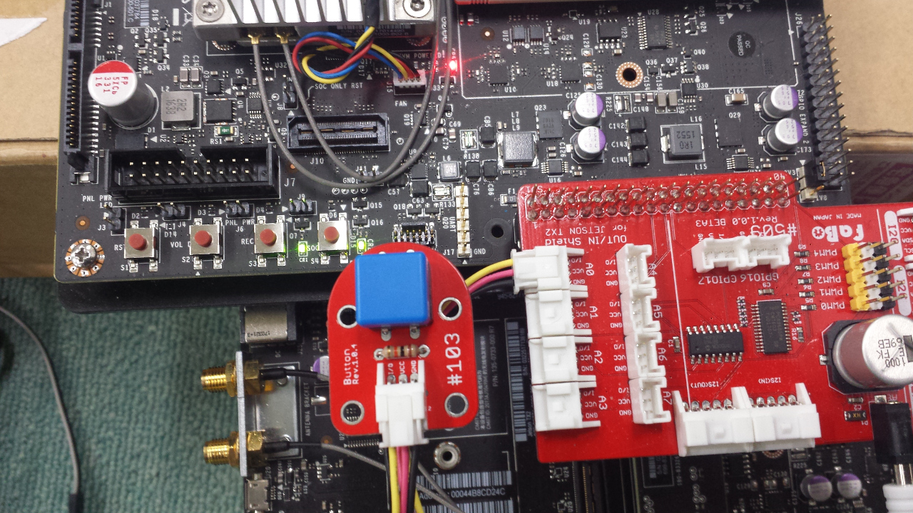

# SPI Fabo #104 回転センサー
Jetson TX2 Docs>JetPack3.2>SPI Fabo #104回転センサー
<hr>

# Point
* rootユーザで実行する

# 接続確認
Faboの#103 Buttonで確認する。  


# 実行
ソースコード：[sample_spi.py](sample_spi.py)
```
sudo python sample_spi.py
```

# 出力
ボタンを押すと値が変化する。
```
adc :        0 
adc :        0 
adc :     1023 
adc :     1023 
adc :        0 
adc :        0 
adc :        0 
adc :        0 
adc :        0 
adc :        0 
adc :     1023 
adc :     1021 
adc :     1023 
adc :     1023 
adc :        0 
adc :        0 
adc :        0 
adc :        0 
adc :        0 
adc :        0 
adc :        0 
adc :     1023 
adc :     1022 
```

Powered by [FaBo](http://www.fabo.io)