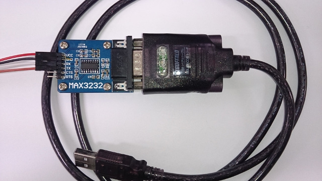

# UART シリアル接続
Jetson TX2 Docs>JetPack3.2>UARTシリアル接続
<hr>


# 接続確認
ターミナル操作はPC側で行い、JetsonTX2側はピンを挿すだけ。
1. USB-TTLシリアルコンソール変換ケーブルを用意する  
MAX3232とBSUSRC06  


2. 接続する TXとRXはクロスさせる  
Jetson TX2 J21 Pin 8 (UART 1 TXD) → MAX3232 RX  
Jetson TX2 J21 Pin 10 (UART 1 RXD) → MAX3232 TX  
Jetson TX2 J21 Pin 9 (GND) → MAX3232 GND  
  


3. 接続を確認する  
```
lsusb  
```
>Bus 001 Device 001: ID 1d6b:0002 Linux Foundation 2.0 root hub  
>Bus 002 Device 004: ID 0403:6001 Future Technology Devices International, Ltd FT232 USB-Serial (UART) IC  
>Bus 002 Device 003: ID 0e0f:0002 VMware, Inc. Virtual USB Hub  
>Bus 002 Device 002: ID 0e0f:0003 VMware, Inc. Virtual Mouse  
>Bus 002 Device 001: ID 1d6b:0001 Linux Foundation 1.1 root hub

```
ls /dev/ttyUSB*
```
>43876 0 /dev/ttyUSB0

4. PCにminicomをインストール、起動する
```
sudo apt-get install minicom
sudo minicom
```

5. minicomを設定する  
>cOnfigure Minicom..O を選ぶ(oキー)  
  

>Serial port setup を選ぶ(矢印キー)
  

>defaultの設定を  
>A -    Serial Device      : /dev/tty8  
>F - Hardware Flow Control : Yes  
>G - Software Flow Control : No  
>下のように書きに書き換える  
>A -    Serial Device      : /dev/ttyUSB0  
>F - Hardware Flow Control : No  
>G - Software Flow Control : Yes  
>Aを書き終えたらReturnキーで確定する。全て書き換えたらReturnキーで戻る。
  

>Save setup as dfl を選んで保存する(矢印キー)
  

>ESCキーで戻り、xキーで一度minicomを終了する
>eXit and reset.....X
  


6. minicomを再起動する
  

7. JetsonTX2の電源を入れると、minicomをJetsonTX2のターミナルとして利用できる
  


Powered by [FaBo](http://www.fabo.io)