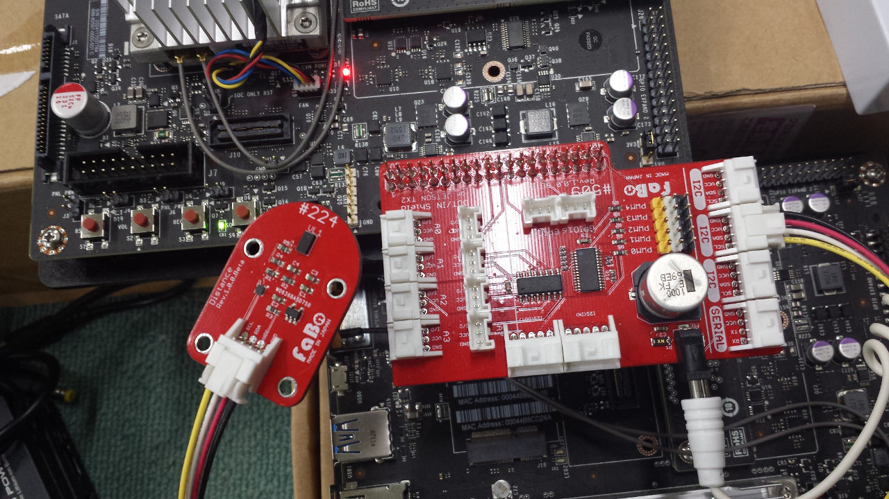

# I2C Fabo #224 VL53L0X 距離センサー
Jetson TX2 Docs>JetPack3.2>I2C Fabo #224 VL53L0X 距離センサー
<hr>

# Point
* rootユーザで実行する。

# 接続確認
Faboの#224 LEDで確認する。  


# I2Cアドレスを確認する
```
sudo i2cdetect -y -r 1
     0  1  2  3  4  5  6  7  8  9  a  b  c  d  e  f
00:          -- -- -- -- -- -- -- -- -- -- -- -- -- 
10: -- -- -- -- -- -- -- -- -- -- -- -- -- -- -- -- 
20: -- -- -- -- -- -- -- -- -- 29 -- -- -- -- -- -- 
30: -- -- -- -- -- -- -- -- -- -- -- -- -- -- -- -- 
40: 40 -- -- -- -- -- -- -- -- -- -- -- -- -- -- -- 
50: -- -- -- -- -- -- -- -- -- -- -- -- -- -- -- -- 
60: -- -- -- -- -- -- -- -- -- -- -- -- -- -- -- -- 
70: 70 -- -- -- -- -- -- --                         
```
Fabo #224 距離センサーは距離計測用チップとしてVL53L0Xを搭載している。このチップのI2Cアドレスは0x29になる。<br>
アドレスが異なる場合はJetson TX2を一度シャットダウンしてJetson TX2とFaboシールドの電源ケーブルを抜く。<br>


# 実行
ソースコード：[sample_vl53l0x.py](sample_vl53l0x.py)
```
sudo python sample_vl53l0x.py
```

# 結果
距離を計測できる。
```
VL53L0X Start Ranging Address 0x29

VL53L0X_GetDeviceInfo:
Device Name : VL53L0X ES1 or later
Device Type : VL53L0X
Device ID : VL53L0CXV0DH/1$1
ProductRevisionMajor : 1
ProductRevisionMinor : 1
API Status: 0 : No Error
VL53L0X_BEST_ACCURACY_MODE
API Status: 0 : No Error
Timing 200 ms
distance1 cm: 2
distance1 cm: 8
distance1 cm: 31
distance1 cm: 39
distance1 cm: 819
distance1 cm: 10
distance1 cm: 4
distance1 cm: 3
distance1 cm: 2
distance1 cm: 2
distance1 cm: 2
distance1 cm: 4
distance1 cm: 3
distance1 cm: 5
distance1 cm: 14
distance1 cm: 819
distance1 cm: 819
distance1 cm: 70
distance1 cm: 62
distance1 cm: 819
distance1 cm: 38
```

Powered by [FaBo](http://www.fabo.io)