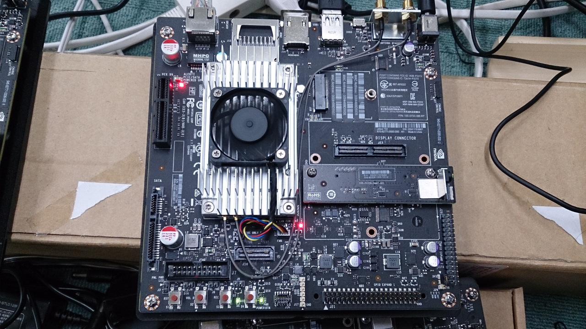
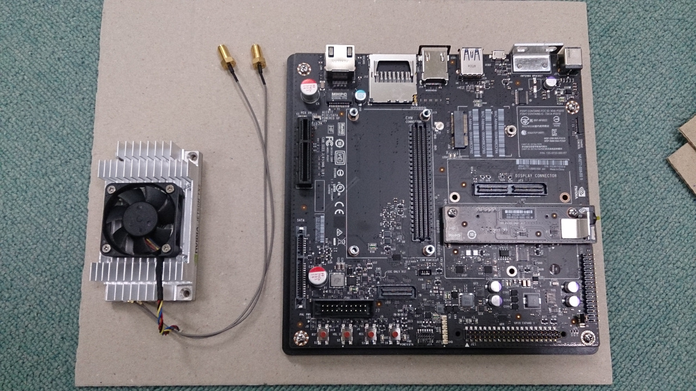
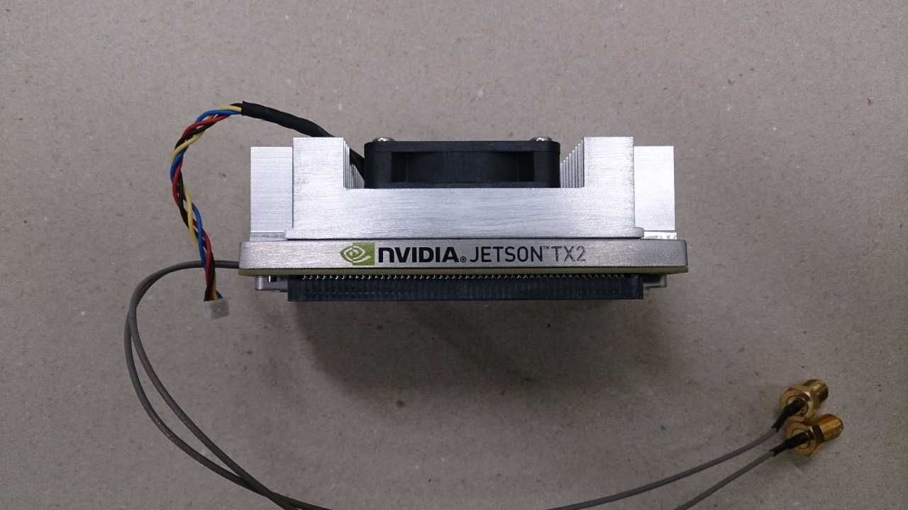
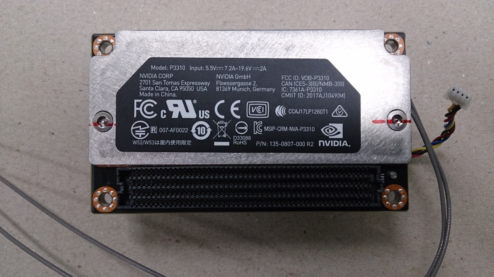

# Jetson TX2 Docs

Jetson TX2 OSインストールから使い方の例までをまとめたドキュメント。

# はじめに
Jetson TX2 はNVIDIAが製造するTegra GPUを搭載したUbuntuベースのコンピュータ。 
市販されているのはDeveloper Kit(DevKit)と呼ばれ、電源ボタンやLANポートなどが付いた、いわゆるマザーボード的なもの(Developer Board)とセットとなっているが、Jetson TX2本体はアルミのヒートシンクに付いている部分であり、ここにストレージ、CPU、GPU、メモリ、OSが詰まっている。 

 
 
 
 

Developer Boardの仕様は公開されており、独自のボード(カスタムボード)にTX2を搭載することが可能である。しかし、その場合は当然ながらカスタムボードに搭載されているチップがDeveloper Boardとは異なるため、カーネルモジュールやブートイメージを変更したカスタムボード用OSに入れ替える必要がある。 

Powered by [FaBo](http://www.fabo.io)